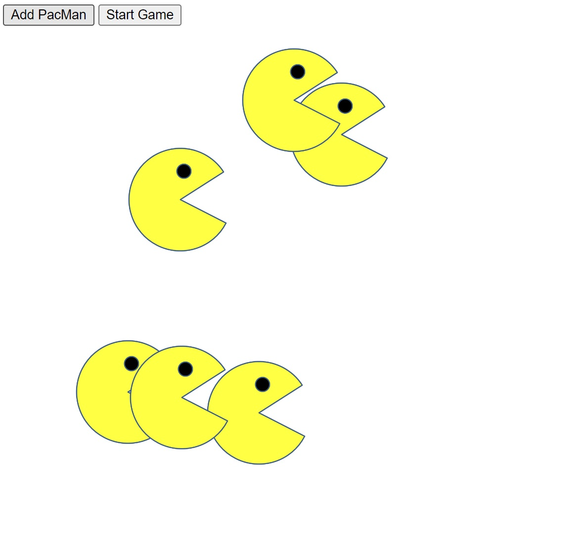

# PacMenFactory

> Factory for making PacMen
>
>> button "Add PacMan" is pressed to position the new PacMan image
>>
>> buttom "Sart Game" is pressed to start moving available PacMen
>>> Each PacMan will bounce off any wall it hits

> Fábrica para crear figuras de PacMan
>
>> El botón "Add PacMan" se presiona para posicionar una
 nueva figura de PacMan
>>
>> El botón "Sart Game" se presiona para iniciar el movimiento de las figuras PacMan posicionadas en la pantalla
>>> Cada PacMan debe rebotar cuando encuentra una pared
  
---


---

<div align="center" id="top"> 
  
  &#xa0;
</div>

<h1 align="center">0107-PacMenFactory</h1>

<p align="center">
  

  

  

  <!--  -->

</p>

<p align="center">
  <a href="#dart-acerca">Acerca</a> &#xa0; | &#xa0; 
  <a href="#sparkles-caracteristicas">Caracteristicas</a> &#xa0; | &#xa0;
  <a href="#rocket-tecnologias>Tecnologias</a> &#xa0; | &#xa0;
  <a href="#white_check_mark-requerimientos">Requerimientos</a> &#xa0; | &#xa0;
  <a href="#checkered_flag-instrucciones">Instrucciones</a> &#xa0; | &#xa0;
  <a href="#memo-licencia">Licencia</a> &#xa0; | &#xa0;
  <a href="https://github.com/betoje" target="_blank">Autor</a>
</p>

---
## :dart: Acerca ##

Proyecto para fabricar figuras de PacMan que luego se mueven en forma aleatoria en la pantalla

## :sparkles: Caracteristicas ##

:heavy_check_mark: Se opera con 4 figuras de PacMan

## :rocket: Tecnologias ##

Los siguientes lenguajes/herramientas fueron usados en este proyecto:

- JavaScript, HTML, CSS
- [mapbox](https://www.mapbox.com/)

## :white_check_mark: Requerimientos ##

Antes de empezar :checkered_flag:, se necesita tener [Git](https://git-scm.com) instalado.

## :checkered_flag: Instrucciones ##

```bash
# Clone este proyecto
$ git clone https://github.com/betoje/0107-PacMenFactory.git

# Acceda al directorio
$ cd 0107-PacMenFactory

# Arrastre el archvo index.html a su navegador de elección
```
## :memo: Licencia ##

Este proyecto está bajo la licencia de MIT. Para mayores detalles vea el archivo [LICENSE](LICENSE).

Hecho con :heart: por <a href="https://github.com/betoje" target="_blank">Alberto Jacome</a>
&#xa0;

<a href="#top">Regresar al inicio</a>
